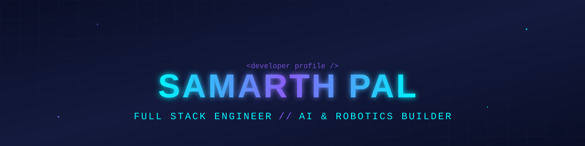

  
  

  
  
  
  

## 👋 About Me

I'm **Samarth** — a Computer Science engineering student and full-stack developer who enjoys
turning real-world problems into working software, with a growing focus on applied AI.

- 🔭 **Currently building** — AI agents and intelligent automation systems as a **Fullstack & AI Engineer Intern**
- 🧠 **Focused on** — full-stack architecture, AI agent pipelines, and automation workflows
- 🌱 **Sharpening** — agentic AI systems, Data Structures & Algorithms
- 🎓 **B.Tech in Computer Science** — AITR Indore, affiliated to RGPV Bhopal &nbsp;(CGPA 8.04, Class of 2027)
- 🤝 **Open to** — software engineering internships & collaboration on interesting projects
- ⚡ **Motto** — *build solutions, not just code*

## 💼 Experience

<table>
<tr><td width="100%">

### 🚀 Fullstack & AI Engineer Intern
**@ [ShipCube LLC](https://shipcube.com)** &nbsp;·&nbsp; `June 2026 – Present`

Working across full-stack, AI, and robotics projects — building scalable applications, AI agents,
computer vision systems, and training robots using Vision Language Action models. Contributing to
system architecture, enterprise AI integrations, automation workflows, and intelligent solutions
across multiple internal products.

</td></tr>
</table>

## 🌟 Featured Projects

<table>
<tr>
<td width="50%" valign="top">

### ⚡ [Hilex](https://github.com/Sambully/Hilex)
AI-powered code IDE that runs entirely in the browser — write, run & preview Node.js apps in real
time with CodeMirror and a built-in WebContainer runtime. Ships an integrated AI agent for inline
suggestions, chat assistance, and draw-to-code generation.

`TypeScript` · `WebContainer` · `AI Agent`

[**`</> Code`**](https://github.com/Sambully/Hilex)

</td>
<td width="50%" valign="top">

### 🪔 [Tribal Mart](https://github.com/Sambully/Tribal-Mart)
A full-stack marketplace connecting India's tribal cooperatives with conscious buyers — with a
unique Agent-assisted listing workflow and a Hindi/English language switcher built for tribal
artisans.

`JavaScript` · `MongoDB` · `AI Agent`

[**`</> Code`**](https://github.com/Sambully/Tribal-Mart)

</td>
</tr>
<tr>
<td width="50%" valign="top">

### 🤖 [Sidekick.ai](https://github.com/Sambully/SideKick.ai)
An always-on digital companion that adapts to you — helps debug code, chat, and provide support,
combining a smart assistant with a friendly presence in your pocket.

`TypeScript` · `AI Assistant`

[**`</> Code`**](https://github.com/Sambully/SideKick.ai)

</td>
<td width="50%" valign="top">

### 🔁 [SkillBarter](https://github.com/Sambully/SkillBarter)
A peer-to-peer platform for exchanging skills — connecting people who want to teach and learn from
one another directly, with no money involved.

`JavaScript` · `Full Stack`

[**`</> Code`**](https://github.com/Sambully/SkillBarter)

</td>
</tr>
</table>

<a href="https://github.com/Sambully?tab=repositories"><b>→ See all repositories</b></a>

## 🛠️ Tech Stack

<table align="center">
<tr><td align="center"><b>Languages</b></td><td>

</td></tr>
<tr><td align="center"><b>Frontend</b></td><td>

</td></tr>
<tr><td align="center"><b>Backend</b></td><td>

</td></tr>
<tr><td align="center"><b>Tools & AI</b></td><td>

&nbsp;
&nbsp;
</td></tr>
</table>

## 🏆 Hackathons & Competitions

| Event | Result |
|:---|:---|
| **SBI Life Hack-AI-Thon** — Le Meridien, New Delhi | 🥈 Semifinalist |
| **CodeSpire 3.0** — College Hackathon | 🔟 Top 10 Finish |
| **CodeSpire 2.0** | 🏁 Finalist |
| **CodeRelay** | 🧩 Showcased Problem-Solving Skills |

## 📊 GitHub Analytics

  
  

## 🤝 Let's Connect

  
  
  

<i>💡 If you're hiring for internships, need an extra pair of hands on a build, or just want to talk shop about AI agents — my inbox is open.</i>

